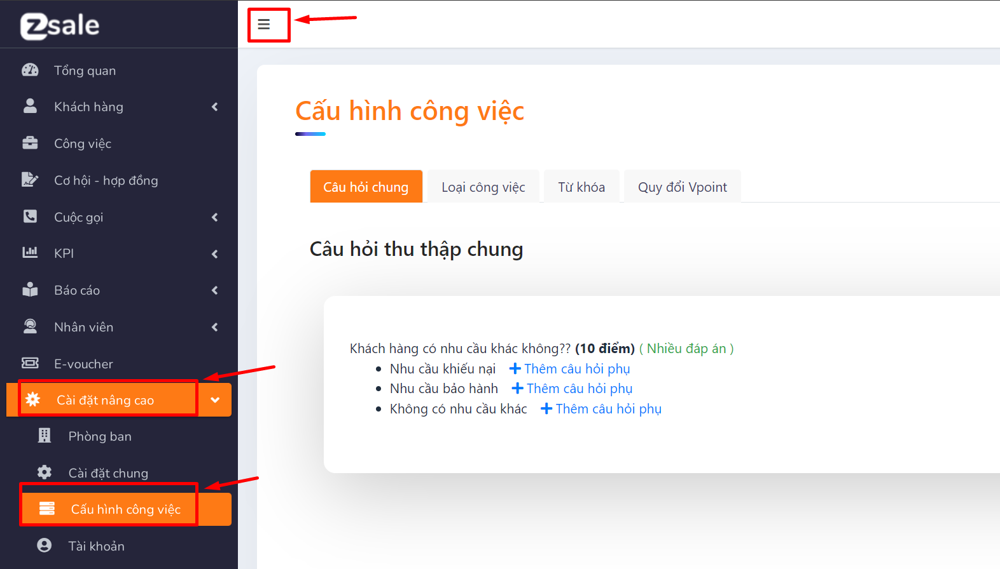

# Cấu hình công việc

Cấu hình công việc : là nơi setup các thông tin liên quan đến công việc

* Cài đặt nâng cao/ cấu hình công việc

<figure><figcaption></figcaption></figure>

* Cấu hình công việc bao gồm : Câu hỏi chung; Loại công việc; Từ khóa; Quy đổi Vpoint

1. **Câu hỏi chung**

Là nơi cấu hình các câu hỏi dùng để thu thập thông tin khách hàng của tất cả các giao việc

**1.1 Thêm câu hỏi**

* Chọn icon thêm

<figure><figcaption></figcaption></figure>

* Nhập tên câu hỏi

.png>)

* Chọn loại câu trả lời( chọn giá trị): Nhập chữ( câu trả lời dạng text); Chọn 1 đáp án; Chọn nhiều đáp án( câu trả lời dạng setlist); Chọn có/không; Chọn ngày ( câu trả lời dạng ngày/tháng/năm)

.png>)

* Nhập điểm kinh nghiệm

.png>)

* Lưu ý: Khi nhập lựa chọn có thể tích vào công việc để tạo luồng chuyển tiếp công việc

.png>)

* Bắt buộc: tích nếu muốn bắt buộc phải trả lời câu hỏi

* Chọn tạo mới

.png>)

**1.2 Sửa câu hỏi**

* Chọn icon sửa

.png>)

* Chọn thông tin cần sửa

.png>)

* Chọn cập nhật

.png>)

**1.3 Xóa câu hỏi**

* Chọn icon xóa

.png>)

* Chọn có

.png>)

2. **Loại công việc**

Là nơi quản lý danh sách loại công việc

**2.1 Tìm kiếm loại công việc**

* Nhập tên loại công việc cần tìm kiếm

.png>)

* Ấn enter

**2.2 Thêm loại công việc**

* Chọn "thêm loại công việc"

.png>)

* Nhập tên công việc

.png>)

* Chọn thêm mới

.png>)

**2.3 Sửa loại công việc**

* Chọn icon sửa ở công việc cần sửa

.png>)

* Nhập tên cần sửa

.png>)

* Chọn lưu

.png>)

**2.4 Xóa loại công việc:**

* Chọn icon xóa ở công việc cần xóa

.png>)

* Chọn "có"

.png>)

* Lưu ý: không thể xóa loại công việc đã gắn trong công việc

3. **Từ khóa**
4. **Quy đổi Vpoint**

Là nơi quản lý sản phẩm và  hoa hồng cho sale

4.1 Tìm kiếm loại sản phẩm quy đổi

* Nhập tên sản phẩm

.png>)

* Ấn enter

4.2 Thêm quy đổi

* Chọn "thêm quy đổi"

.png>)

* Nhập tên sản phẩm/ Tỉ lệ quy đổi

.png>)

* Chọn thêm mới

.png>)

4.3 Sửa sản phẩm

* Chọn icon sửa ở sản phẩm cần sửa

.png>)

* Nhập thông tin cần sửa

.png>)

* Chọn cập nhật

.png>)

4.4 Xóa sản phẩm

* Chọn icon xóa ở sản phẩm cần xóa

.png>)

* Chọn "có"

.png>)
