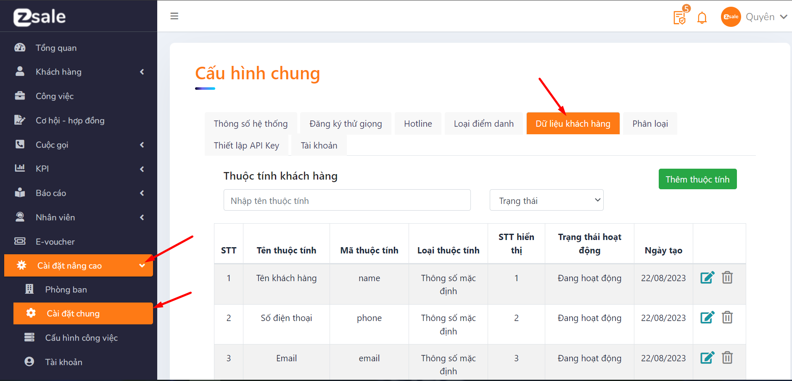
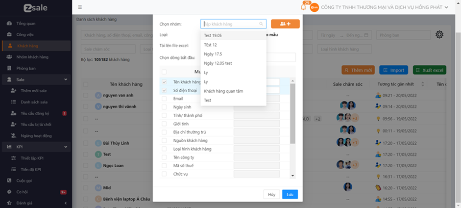

# Quản lý khách hàng

### [1.    Thiết lập cấu hình thông tin khách hàng](https://docs.google.com/document/d/10kbrWNVQbFqV\_uSlrHfb2nM8g93JOJ7-e1BjVvOaGiI/edit#heading=h.hyhut2cz229c)

Để có thể thiết lập cấu hình thông tin của khách hàng theo doanh nghiệp của người dùng thì người dùng làm như sau:

* Chọn Cài đặt nâng cao/ Cấu hình chung/ Dữ liệu khách hàng

<figure><figcaption></figcaption></figure>

* Tại màn Cấu hình chung, chọn Dữ liệu khách hàng.

Màn hình hiển thị:

.png>)

●       Thêm dữ liệu khách hàng

Hệ thống sẽ hỗ trợ 13 dữ liệu khách hàng là: Tên khách hàng, số điện thoại, email, ngày sinh, tỉnh thành phố, giới tính, địa chỉ thường trú, nguồn khách hàng, loại hình khách hàng, tên công ty, mã số thuế, chức vụ, ghi chú.

Người dùng có thể thêm dữ liệu khách hàng theo các bước như sau:&#x20;

Bước 1: Ấn chọn Thêm thuộc tính

&#x20;.png>)

Màn hình xuất hiện:

&#x20;.png>)

Bước 2: Nhập Tên thuộc tính, Loại thuộc tính và STT hiển thị của thuộc tính.

Bước 3: Ấn Lưu để thêm thuộc tính hoặc ấn Đóng để hủy thêm thuộc tính.

### 2. Thêm mới khách hàng

#### 2.1 Thêm mới thủ công 1 khách hàng 

Bước 1: Chọn Thêm mới

.png>)

&#x20;

Màn hình xuất hiện:

.png>)

Bước 2: Điền thông tin khách hàng ( Những ô có dấu \* là những trường bắt buộc nhập ).

Bước 3: Chọn công việc mà người dùng muốn thêm khách hàng vào.

.png>)

Bước 4: Ấn Lưu để lưu thông tin khách hàng hoặc ấn Hủy để không lưu thông tin và quay lại màn hình danh sách khách hàng.

.png>)

Nếu số điện thoại vừa nhập đã được lưu trong hệ thống thì màn hình sẽ hiển thị thông báo “ _Số điện thoại đã tồn tại_ ”.

Nếu màn hình hiển thị thông báo: “ _Thêm mới thành công_ “ tức là đã thêm mới khách hàng thành công

#### [2.2  Thêm mới nhiều khách hàng](https://docs.google.com/document/d/10kbrWNVQbFqV\_uSlrHfb2nM8g93JOJ7-e1BjVvOaGiI/edit#heading=h.bxva6d32goms) 

**2.2.1 Import nhanh**

&#x20;Bước 1: Ấn import&#x20;

.png>)

Màn hình xuất hiện như hình dưới đây:

.png>)

Bước 2: Click chuột vào ô Tập khách hàng để chọn nhóm khách hàng đã tạo trước đó:

&#x20;

Hoặc ấn chọn .png>) để tạo nhóm mới

.png>)

Màn hình hiển thị:

.png>)

Bước 3: Nhập tên nhóm rồi ấn Lưu. ( Tên nhóm là trường bắt buộc nhập )

Nếu chưa nhập tên nhóm mà ấn Lưu hệ thống sẽ hiện lên cảnh báo: _“ Vui lòng nhập tên nhóm “_

Bước 4: Ấn chọn file excel để tải file excel khách hàng vào hệ thống.

.png>)

Bước 5:

\-  Nhập dòng bắt đầu thực hiện lấy dữ liệu từ file excel vừa tải lên

\- Chọn những mục muốn lấy dữ liệu

\- Nhập cột tương ứng trong file excel vừa tải lên.

Ví dụ: trong file excel của bạn mục Tên khách hàng nằm ở cột thứ 1, số điện thoai nằm ở cột thứ 3, email ở cột thứ 5 và dữ liệu ở các cột bạn muốn lấy bắt đầu từ dòng thứ 2 thì thực hiện như hình dưới đây:

.png>)

Bước 6: Ấn Lưu để bắt đầu import dữ liệu vào hệ thống.

Sau đó hệ thống sẽ gửi thông báo import kết thúc.

Khách hàng thêm mới thành công sẽ được đưa vào danh sách khách hàng.

Khách hàng bị trùng số điện thoại với khách hàng đã có trong hệ thống thì hệ thống sẽ tự động cập nhật thông tin trong danh sách khách hàng

Khách hàng bị sai dữ liệu hệ thống trả về kết quả dữ liệu nào đã bị lỗi.

Người dùng có thể tải kết quả import về để xem các trường dữ liệu bị lỗi.

.png>)

Người dùng có thể tải kết quả import về để xem các trường dữ liệu bị lỗi.

**2.2.2   Import theo mẫu**

Bước 1: Chọn import theo mẫu

.png>)

Bước 2: Tải Mẫu excel về máy

.png>)

Bước 3: Nhập dữ liệu khách hàng vào file mẫu excel

Bước 4: Tải file excel đã có dữ liệu lên hệ thống&#x20;

.png>)

Bước 5: Ấn Lưu để lưu file excel thông tin khách hàng hoặc ấn Hủy để hủy import dữ liệu.

Sau đó hệ thống sẽ gửi thông báo import kết thúc&#x20;

Khách hàng thêm mới thành công sẽ được đưa vào danh sách khách hàng.

Khách hàng bị trùng số điện thoại với khách hàng đã có trong hệ thống thì hệ thống sẽ tự động cập nhật thông tin trong danh sách khách hàng

Khách hàng bị sai dữ liệu hệ thống trả về kết quả dữ liệu nào đã bị lỗi.

Người dùng có thể tải kết quả import về để xem các trường dữ liệu bị lỗi.

.png>)

### 3. Tùy chỉnh bộ lọc, cấu hình hiển thị và thông tin khách hàng

Người dùng có thể lọc khách hàng, tùy chỉnh bộ lọc và cấu hình hiển thị thông tin khách hàng

Bước 1: Ấn Khách hàng. Màn hình xuất hiện giao diện danh sách khách hàng

.png>)

#### 3.1.    Lọc và thay đổi bộ lọc

**3.1.1  Lọc**

.png>)

**3.1.2  Thay đổi bộ lọc**

Người dùng muốn lọc theo thuộc tính nào thì tùy chỉnh bộ lọc theo các bước dưới đây

Bước 1: Ấn chọn .png>) .

.png>)

Bước 2: Ấn chọn Cấu hình bộ lọc

.png>)

Màn hình hiển thị:

.png>)

Bước 3: Kéo thả các mục muốn sử dụng để lọc từ bên Thông tin khác sang Thông tin hiển thị. ( Các thuộc tính hiển thị ở Thông tin khác chính là những thuộc tính mà người dùng đã tùy chỉnh ở phần[Cấu hình dữ liệu khách hàng](https://docs.google.com/document/d/10kbrWNVQbFqV\_uSlrHfb2nM8g93JOJ7-e1BjVvOaGiI/edit#heading=h.hyhut2cz229c)

.png>)

Bước 4: Ấn Xác nhận để đồng ý thay đổi hoặc ấn Hủy để hủy bỏ thay đổi

#### 3.2  Thay đổi cấu hình hiển thị 

Người dùng muốn sau khi lọc những thông tin nào của khách hàng sẽ được hiển thị thì làm theo các bước dưới đây

Bước 1: Ấn chọn .png>) . Sau đó ấn chọn Cấu hình hiển thị

.png>)

Bước 2: Ấn chọn Cấu hình hiển thị màn hình sẽ hiển thị:

.png>)

Bước 3: Kéo thả các mục muốn hiển thị thông tin từ bên Thông tin khác sang Thông tin hiển thị. ( Các thuộc tính hiển thị ở Thông tin khác chính là những thuộc tính mà người dùng đã tùy chỉnh ở phần [Thiết lập cấu hình thông tin khách hàng](https://docs.google.com/document/d/10kbrWNVQbFqV\_uSlrHfb2nM8g93JOJ7-e1BjVvOaGiI/edit#heading=h.hyhut2cz229c) )

&#x20;

Bước 4: Ấn Xác nhận để đồng ý thay đổi hoặc ấn Hủy để hủy bỏ thay đổi.

### 4. Tạo nhóm khách hàng 

&#x20;                       Bước 1: Chọn Khách hàng và chọn Nhóm khách hàng. Màn hình hiển thị như hình dưới đây và người dùng ấn chọn Thêm mới

.png>)

Màn hình hiển thị:

.png>)

Bước 3: Nhập tên nhóm  và nhập Mô tả về nhóm ( bắt buộc nhập )

Bước 4: Ấn lưu để tạo nhóm.

Sau khi thêm mới khách hàng thành công hệ thống hiển thị thông báo: “_Thêm mới thành công “_

### 5. Xem lịch sử tương tác của khách hàng và chỉnh sửa thông tin khách hàng 

#### 5.1 Xem lịch sử tương tác của khách hàng 

Lịch sử tương tác của khách hàng sẽ lưu lại những lần tương tác của hệ thống với khách hàng và trạng thái của khách hàng ( 11 loại tương tác: Khách hàng tiềm năng, khách hàng chốt hợp đồng, khách hàng từ chối, gọi đến, gọi đi, gọi nhỡ, chỉnh sửa khách hàng, giao sale chăm sóc, lịch hẹn, thêm mới, phân loại )

&#x20;

Bước 1: Ấn chọn 1 khách hàng

.png>)

Bước 2: Màn hình hiển thị như hình dưới đây và người dùng ấn Chi tiết để xem Phiếu kết quả cuộc gọi và đánh giá cho cuộc gọi

.png>)

Màn hình hiển thị phiếu kết quả cuộc gọi và đánh giá cuộc gọi:

.png>)

#### 5.2 Chỉnh sửa thông tin khách hàng

Bước 1: Chọn khách hàng muốn chỉnh sửa thông tin

.png>)

Bước 2: Màn hình sẽ hiển thị chi tiết khách hàng như dưới đây. Sau đó người dùng chọn  để chỉnh sửa thông tin khách hàng

.png>)

Màn hình hiển thị form Cập nhật thông tin

.png>)

Bước 3: Điền thông tin khách hàng ( Những ô có dấu \* là những trường bắt buộc điền )

Bước 4: Ấn Lưu để lưu thông tin khách hàng hoặc ấn Hủy để không lưu và quay trở lại màn hình chi tiết khách hàng.&#x20;

Sau khi cập nhật thông tin thành công hệ thống hiển thị thông báo: “ _Cập nhật thông tin thành công “_&#x20;

### 6. Xóa khách hàng và Giao sale chăm sóc

#### 6.1 Xóa khách hàng 

Bước 1: Để chọn 1 hoặc nhiều khách hàng, click chuột vào ô  của khách hàng muốn chọn.

.png>)

Để chọn tất cả khách hàng trong Danh sách khách hàng, click chuột vào ô Chọn tất cả

.png>)

Bước 2: Click chuột vào biểu tượng .png>)  hệ thống hiển thị thông báo xác nhận có chắc chắn muốn xóa hay không?

.png>)

Bước 3: Chọn Xóa hoặc Hủy. Chọn Xóa là xác nhận xóa các khách hàng đã chọn. Chọn Hủy để hủy xóa khách hàng.

_\*Lưu ý: Khách hàng bị xóa sẽ không thể khôi phục lại._

#### 6.2 Giao sale chăm sóc 

Bước 1: Click chuột vào ô .png>) để chọn khách hàng muốn giao việc hoặc muốn thu hồi. Sau đó click chuột vào nút Giao sale chăm sóc

.png>)

Hệ thống hiển thị màn hình Giao cho sale chăm sóc. Người dùng có thể chọn Giao việc để giao việc cho sale chăm sóc hoặc chọn Thu hồi để thu hồi khách hàng khỏi giao việc. Có thể sử dụng cả 2 chức năng thu hồi và giao việc cùng 1 lúc.

.png>)

**6.2.1 Giao việc**

Tại màn hình Giao cho sale chăm sóc đã được tích chọn chức năng Giao việc (Có thể bỏ tích chọn Giao việc).

Bước 1: Chọn công việc đã được tạo từ trước hoặc tạo công việc mới.

§  Click vào ô Chọn công việc để chọn 1 công việc đã được tạo.

&#x20;.png>)

§  Hoặc click vào biểu tượng  .png>)  để tạo một công việc mới. Hệ thống hiển thị màn hình Tạo công việc

.png>)

§  Nội dung công việc và Loại công việc là 2 trường bắt buộc điền, không bắt buộc điền Mục tiêu. Ấn Lưu để tạo công việc hoặc ấn Hủy để Hủy tạo công việc.

Hệ thống hiển thị thông báo: “_Thành công_” là đã tạo công việc thành công.

§  Sau khi tạo công việc thành công, click vào ô Chọn công việc để chọn công việc vừa được tạo.

Bước 2: Điền nội dung giao việc ( Không được để trống Nội dung giao việc )

Hệ thống đã có sẵn nội dung giao việc, người dùng có thể thay đổi nội dung giao việc.

.png>)

Bước 3: Chọn sale chăm sóc.

§  Click chuột vào ô Chọn sale chăm sóc, hệ thống sẽ hiển thị danh sách các sale đang hoạt động trong hệ thống. Người dùng chọn sale nào thì bảng Danh sách sale sẽ hiện tên của sale đó.

.png>)

§  Click chuột vào ô  để chọn sale muốn giao việc. Sale được chọn sẽ hiển thị tên vào số lượng khách hàng được giao trong phần Sale chăm sóc

.png>)

§  Người dùng có thể thay đổi số lượng khách hàng được giao cho sale, sao cho số khách hàng được giao cho sale phải bằng số khách hàng đã chọn ngoài màn Danh sách khách hàng.

§  Số lượng khách hàng là số lượng khách hàng đã được chọn ngoài màn Danh sách khách hàng.

§  Có thể bỏ tích chọn sale chăm sóc bằng cách click chuột vào biểu tượng  của sale muốn xóa hoặc bỏ tích chọn sale trong bảng Danh sách sale.

§  Nếu tích chọn ô Giao trực tiếp không cần sale xác nhận thì công việc bắt buộc sale phải nhận việc. Nếu bỏ tích chọn ô Giao trực tiếp không cần sale xác nhận thì sale có thể từ chối không nhận công việc này.

Bước 4: Ấn Giao việc để giao việc hoặc ấn Hủy để Hủy giao việc.

Sau khi ấn Giao việc, hệ thống thông báo: _“Thành công”_ là đã giao việc thành công.

**6.2.2 Thu hồi**

Bước 1: Tại màn Giao cho sale chăm sóc, tích chọn chức năng Thu hồi

.png>)

Bước 2: Chọn giao việc muốn thu hồi khách hàng (Chỉ thu hồi những khách hàng đã được chọn ngoài màn DSKH khỏi giao việc).

.png>)

Bước 3: Ấn Thu hồi để thu hồi khách hàng khỏi giao việc hoặc ấn Hủy để không thu hồi khách hàng.

Sau khi ấn Thu hồi, màn hình hiển thị thông báo: _“ Thành công “_ là đã thu hồi khách hàng khỏi giao việc thành công.
